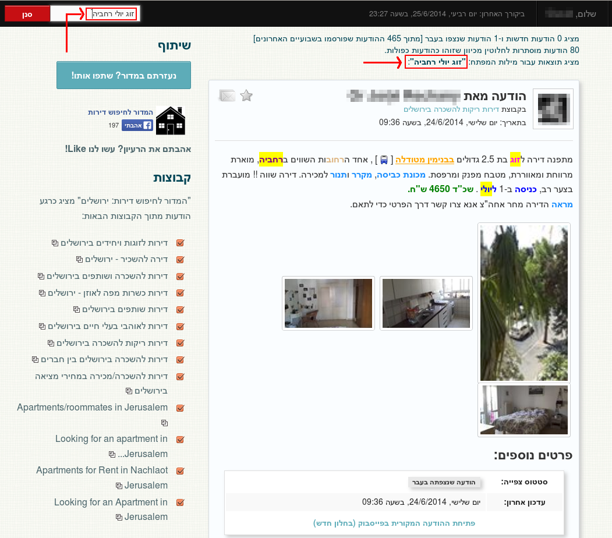
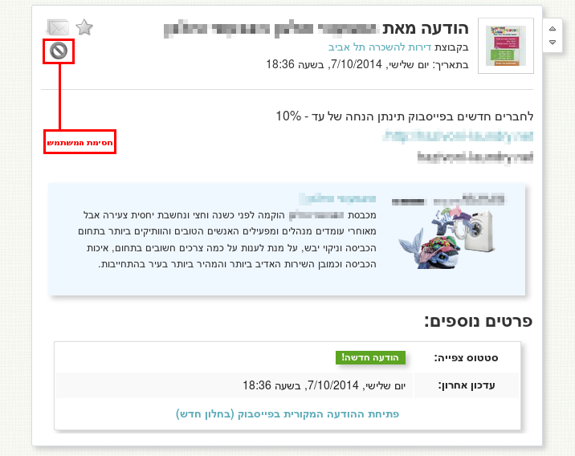
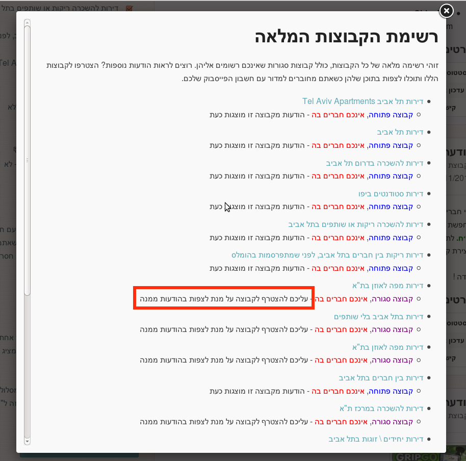
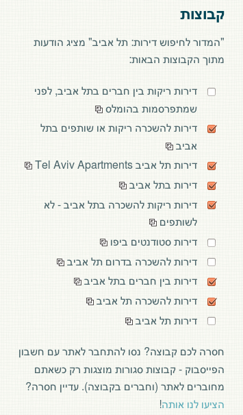
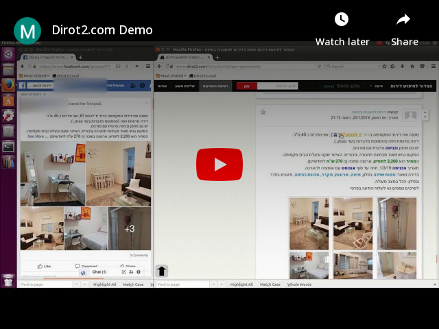

# Home Finder

This repository contains the source code for a website which would help users find apartments for rent via Facebook groups.
The website would use the Graph API to connect to a predefined list of Facebook groups dedicated to advertising apartments for rent, and would display the different posts together with extra layers of information.

Features:
- Aggregation of posts from multiple groups, saving the need to visit every group independently
  - Each post contains the publisher name and profile picture, message text, images attached to the post, comments about the post and a link to the original post on Facebook
  - When several similar posts are posted to different groups, all comments from all groups are shown under the post
  - Similar posts can be hidden (only one post will be displayed)
- Posts are sorted according to publish date and not last comment date (as opposed to Facebook groups), allowing users to avoid seeing the same posts again and again just because someone has commented on them and bumped them up
- Filter and search capabilities
- Location identification – allowing users to click on addresses in order to view them on a map, and even calculate the suggested route from the apartment location to a predefined custom target location (such as the user’s workplace)
- Keyword highlighting (highlighting important keywords such as price, neighborhood, street, date of entry, furniture, type of renter [sublet, roommate, couple]) - allowing the users to quickly identify the most relevant properties of the apartment
- Ability to save relevant posts
- Ability to block posts from selected users (such as known spammers)
- Ability to show/hide posts from selected groups only
- When logging in via Facebook, ability to sync current read location across devices

## History 
At first (2013), the site allowed viewing posts from public groups, and if a user was logged in, also from closed groups which the user belonged to.

At some stage (2015), Facebook blocked the ability to retrieve data from closed groups, and allowed fetching data from public groups only.

Eventually (2018), Facebook blocked this ability too, therefore killing the use case.

Hopefully, the ability to read posts from groups (at least public ones) will return in the future.

The website was available via http://www.dirot2.com and https://home-finder.herokuapp.com/ .

Facebook page: https://www.facebook.com/dirot2/ 

## Images

### Example Post

  

### Search Capabilities

  

### Ability to Block Spammers

  

### Groups List

  

### Ability to Filter Groups

  

### Video Demo

  

